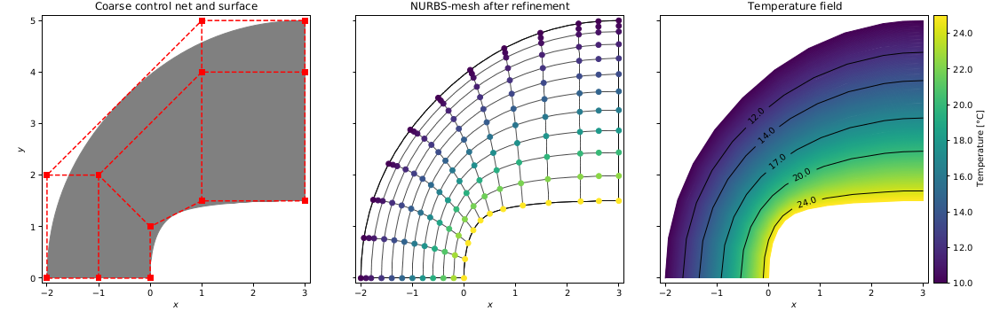
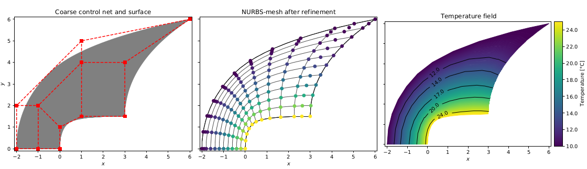
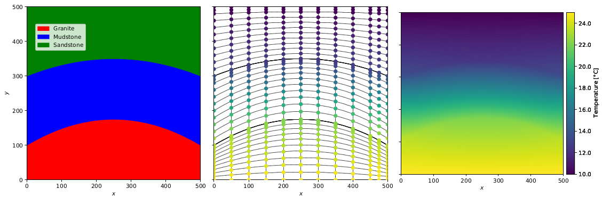
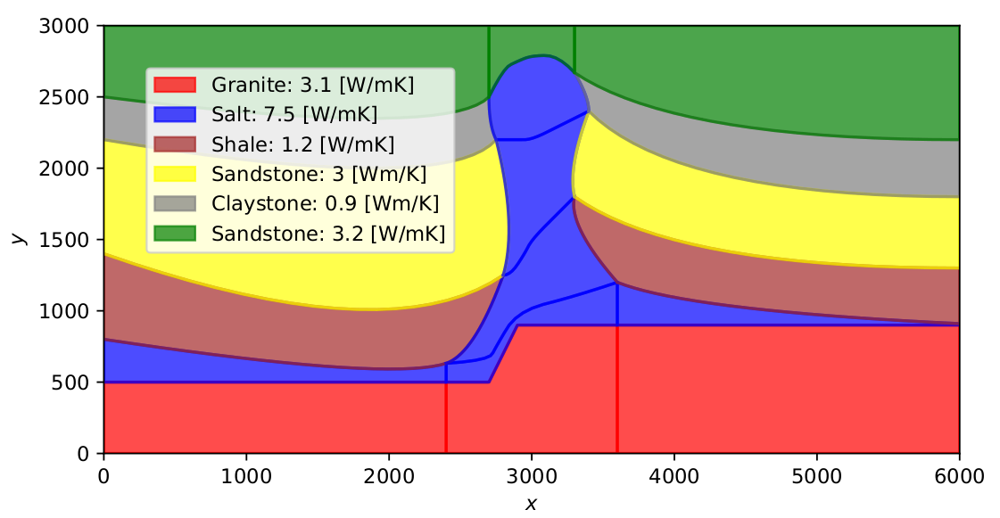
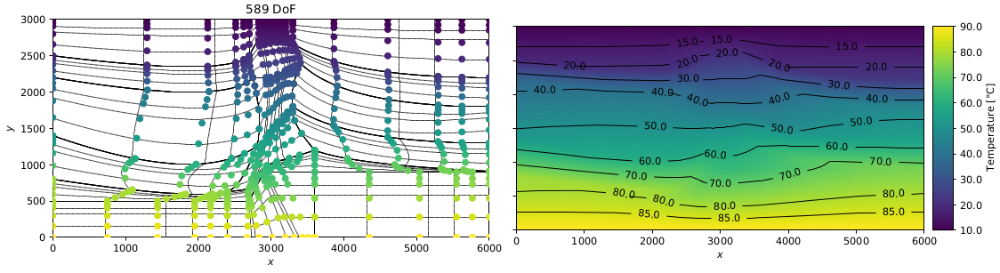

# pyGeoIGA
### Making sense of Isogeometric Analysis for geothermal applications: Parametric geomodeling (NURBS) for fast model construction, simulation and adaptation


Table of Contents
--------
* [Introduction](README.md#introduction)
* [Features](README.md#features)
* [Requirements](README.md#requirements)
* [Installation](README.md#installation)
* [Project Development](README.md#project-development)
* [Citation](README.md#citation)

Introduction
--------

Isogeometric analysis (IGA) is a technique that uses the power of the finite element method
(FEM) to numerically solve differential equations without the need of creating a discretization
in the space of the geometric object (i.e., a mesh). Instead, it uses computer-aided design
(CAD) tools, specifically Non-Uniform Rational B-splines (NURBS), to accurately represent
any geometry and perform analysis during design. 




This method has not been used in a Geoscientic context, where the geometry of subsurface structures greatly influences the solution
of a simulation. This package introduces the isogeometric analysis technique in an easy language and tutorials to guide 
the user during the construction and analysis. 



It differs from other implementations for dealing with multipatch structures, focusing on geological modelling with multiple subdomains.





Additionally, the Bézier extractor operator is introduced, providing an element structure that can
incorporate IGA into existing finite element codes.

Features
--------

* [Creation of NURBS](tutorials/01_Create%20single%20patch%20NURBS%20and%20plot%20-%20Matplotlib%20and%20pyvista.ipynb): 
Create any curves and surfaces using NURBS
* [Creation of Multiple patches](tutorials/02_Create%20multipatch%20NURBS%20and%20plot.ipynb): Create multiple patches of NURBS
* [Refinement](tutorials/04_Multipatch%20global%20refinement.ipynb): Knot insertion and degree elevation for the refinement of patches
* [Topology](tutorials/08_Pre-processing%20workflow.ipynb): Define topological relations between patches
* [Assemble of stiffness matrix](tutorials/09_Assemble%20stiffness%20matrix%20and%20solve.ipynb): Routines for assembling stiffnes matrix and solving
* [Post-processing](tutorials/10_Complete%20workflow%20with%20salt%20dome%20model.ipynb): Plotting of solutions
* [Exports to FEniCS](tutorials/13_Export%20to%20FEniCS.ipynb) and [MOOSE](tutorials/14_Export%20to%20MOOSE.ipynb)
* [Bézier extraction operator](tutorials/15_Bezier_extraction_workflow.ipynb): Complete workflow for using the bezier extractor operator

Requirements
--------
    matplotlib >= 3.2.1
    numpy
    scipy
    ipython
    jupyter
    pyvista
    pytest
    PyQt5
    pygmsh==6.1.1
    gmsh
    meshio==4.0.3

(Optionals)

[igakit](https://bitbucket.org/dalcinl/igakit/src/master/): Fullly compatible with the nurbs this library produces. 
And the degree elevation routine depends completelly of this
```
pip install https://bitbucket.org/dalcinl/igakit/get/master.tar.gz
```  
[FEniCS](https://fenicsproject.org/): Finite element framework. Usefull for comparison and control of solutions. Follow the [instructions](https://fenicsproject.org/download/) for the installation

Installation
--------
For a local installation do:
```
pip install -e .
```

Project Development
-------------------

Author: Daniel Escallón


Citation
-------
If you use pyGeoIGA in a scientific abstract or publication, please include appropriate recognition of the original work. For the time being, please cite the publication in the conference abstract:

Escallon, D., Degen, D., Moulaeifard, s. M., and Wellmann, F.: Making sense of Isogeometric Analysis for geothermal applications: Parametric geomodelling (NURBS) for fast model construction, simulation and adaptation, EGU General Assembly 2022, Vienna, Austria, 23–27 May 2022, EGU22-2436, https://doi.org/10.5194/egusphere-egu22-2436, 2022. 
